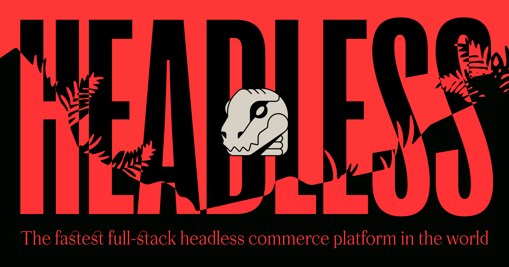

# Zyla

The fastest full-stack headless commerce platform in the world.

# Overview

Zyla is the fastest end-to-end headless commerce stack that blends cutting-edge content management and commerce tools that can accept payments and ship worldwide on deployment.

# Requirements

* [Dola](https://dola.me) merchant account 
* [Vercel](https://vercel.com)

# Getting Started

1. Go to [zyla.rocks](https://zyla.rocks) and click `Deploy Now`
2. Select your [Starter Kit](#starter-kits)
3. Add the necessary credentials
4. Finalize your project details
5. Deploy!

Once your project has been deployed on Vercel, you'll receive a public URL with an SSL automatically applied.

To add your own domain, read the [Custom Domains](https://vercel.com/docs/custom-domains) guide on Vercel.

Note, domains typically get applied within minutes; however, it may take 24-48 hours for your DNS to fully resolve.

# Starter Kits

Each starter kit comes integrated with [BEP](https://bep.life) and [Dola](https://dola.me), and preconfigured to be 1-click deployable on Vercel using `Deploy Now`.

### BEP

B.E.P. or Backendless Ecommerce Platform turns any website into a shop with just 1-line of code, no backend or CMS required. Plus, it's free, minus standard processing fees (2.9% + $0.30, per transaction).

### Dola

Dola is a 1-click checkout and digital wallet. Unlike Apple, Google, or Shop Pay, Dola works on every browser and device, and is platform agnostic.

### Starter Kits

* [GraphCMS](https://github.com/dolapay/bep-examples/tree/main/with-graphcms-next)
* Saelor (Coming Soon)
* Contentful (Coming Soon)
* Ghost (Coming Soon)  
* Prismic (Coming Soon)

# Browser Compatibility

- last 2 Chrome versions
- last 2 Firefox versions
- last 2 Edge versions
- modern browsers

# Contribute

If you like the idea behind BEP and want to become a contributor - do not hesitate and check our list of the active issues or contact us directly via zyla@dola.me or [join our Discord](https://discord.gg/9ZbKMHa).

If you have discovered a :ant: or have a feature suggestion, feel free to create an issue on Github.
